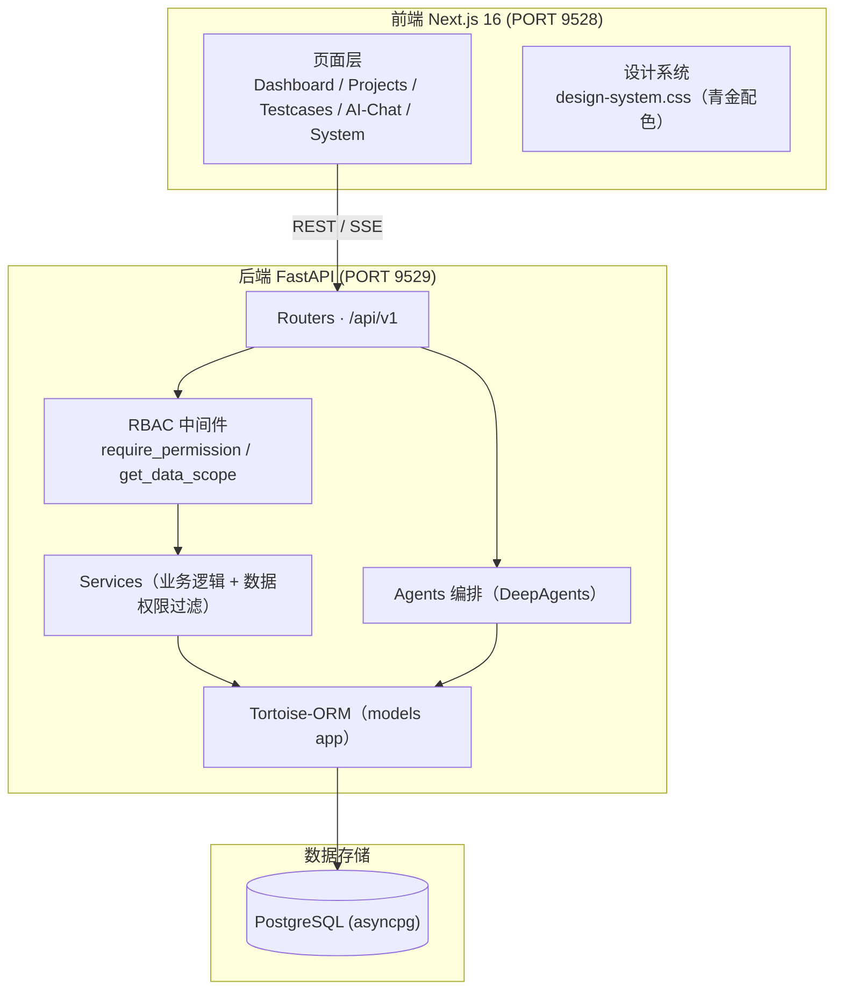
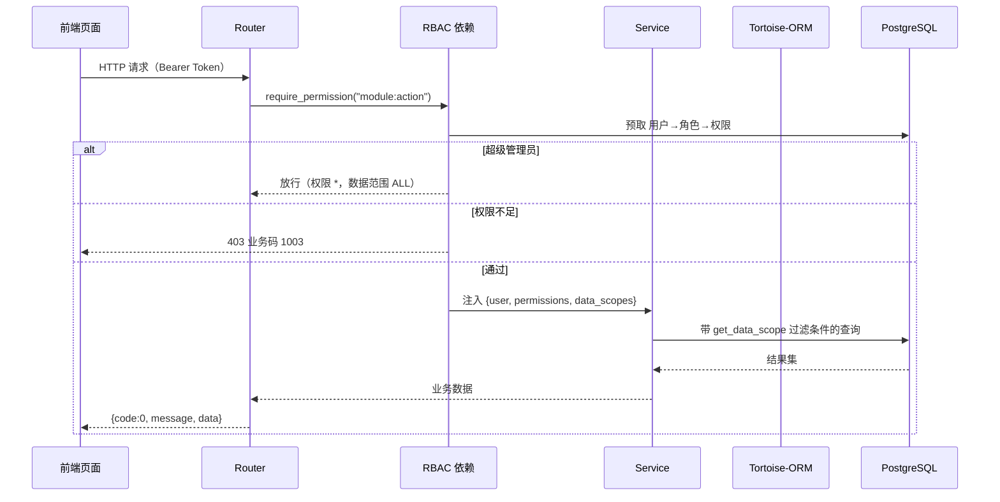
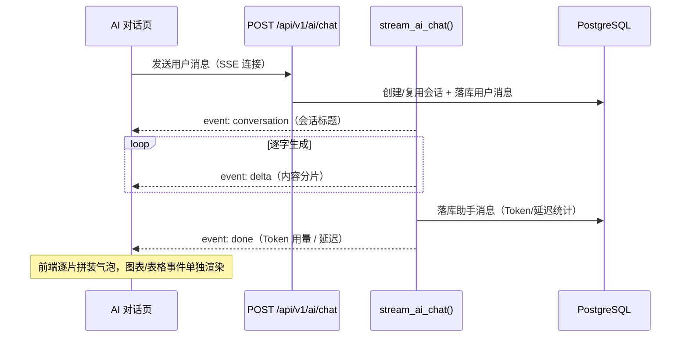
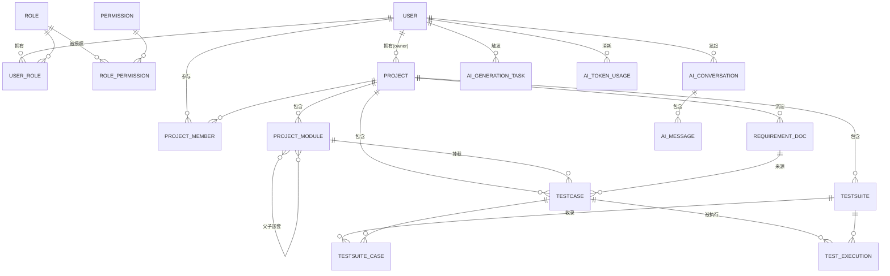

# 河图智弈（Hetu）

> 循河图数理 · 以智弈控测 —— 企业级 AI 智能体测试管理平台

河图智弈（Hetu）是一款**模块化单体架构**的企业级 AI 驱动测试管理平台。它以「项目 → 模块 → 用例 → 套件 → 需求文档 → 执行」为主线，融合 RBAC 细粒度权限与数据隔离，并通过 AI 智能体提供对话式测试分析与 AI 用例生成能力。

- **后端**：FastAPI + Tortoise-ORM（PostgreSQL）+ DeepAgents（AI 智能体编排）
- **前端**：Next.js 16（App Router）+ React 19 + Tailwind CSS 4 + TypeScript

---

## 一、功能总览

| 模块 | 核心能力 |
| ---- | -------- |
| **认证与账号** | 图形验证码登录 / JWT 令牌、记住登录、`/auth/me`、修改密码、个人资料维护 |
| **用户 · 角色 · 权限** | 用户 CRUD + 启停 + 重置密码 + 角色分配；角色 CRUD + 权限绑定 + 数据权限范围；权限点菜单 / 操作（`domain:action`）/ 数据三级管理 |
| **项目管理** | 项目 CRUD、归档（只读）、概览统计；模块树（支持多级父子）；成员管理与项目内角色（负责人 / 测试成员 / 只读成员） |
| **用例管理** | 用例树 + 表格管理、优先级 / 类型 / 状态筛选、批量删除 / 移动 / 状态 / 优先级；测试套件（选入用例 + 拖拽排序）；需求文档上传与全文检索；执行记录 + 统计 |
| **AI 对话分析** | SSE 流式对话、会话历史管理、图文（表格 / 图表）渲染、Token 用量记录 |
| **AI 用例生成（脚手架）** | 基于需求文档的 AI 用例生成任务（暂为模拟能力） |

> 前端部分页面已预留占位能力（跑通交互但后端暂未落地），详见末尾「已知占位功能」。

---

## 二、系统架构

### 2.1 全局架构图



### 2.2 请求处理时序



### 2.3 AI 对话 SSE 流



---

## 三、数据模型（15 张表）



| 表 | 说明 |
| -- | ---- |
| `user` | 用户：用户名 / 密码哈希（bcrypt）/ 真实姓名 / 启停 / 超级管理员标记，M2M `user_role` |
| `role` | 角色：唯一名称与 `code`、`data_scope`（`self`/`project`/`all`）、`is_builtin`，M2M `role_permission` |
| `permission` | 权限点：`type`（`menu`/`action`/`data`）、唯一 `code`（`domain:action`）、自引用父级形成权限树 |
| `project` | 项目：`code`/`name`/负责人 / 状态 / 起止日期 |
| `project_module` | 项目模块：自引用父级，支持多级模块树 |
| `project_member` | 项目成员：`project_role`（`owner`/`tester`/`viewer`），唯一 `(project_id, user_id)` |
| `testcase` | 用例：`code`（`TC-项目-序号`）/ 模块 / 优先级（P0–P3）/ 类型 / 状态 / AI 生成标记 / 需求来源 |
| `testsuite` | 测试套件：项目归属 + 收录用例 |
| `testsuite_case` | 套件用例关联：排序字段，唯一 `(suite, testcase)` |
| `test_execution` | 执行记录：用例 / 套件 / 结果（passed / failed / blocked / skipped）/ 执行人 / 缺陷链接 |
| `requirement_doc` | 需求文档：`file_type`（markdown / word / pdf / text），支撑上传 + 全文检索 |
| `ai_generation_task` | AI 用例生成任务（脚手架）：提示词 / 状态 / 生成与保存数量 / 结果预览 |
| `ai_conversation` | AI 会话：标题（取首条消息前 50 字）、最后消息时间，软删除 |
| `ai_message` | AI 消息：`role`（user / assistant / system）、图表与数据表 JSON、所用技能、Token 用量、延迟 |
| `ai_token_usage` | Token 用量：模型名 / 输入输出 Token / 费用 |

公共横切：`TimestampMixin`（`created_at` / `updated_at`）与 `SoftDeleteMixin`（`is_deleted` / `deleted_at`），主业务表均支持**软删除**。

---

## 四、RBAC + 数据权限

**核心模型**：用户 ─N:M─ 角色 ─N:M─ 权限。

- **权限类型**：`menu`（菜单）/ `action`（操作，`domain:action`）/ `data`（数据）。
- **数据权限范围**：`data_scope ∈ {self, project, all}`（默认 `self`），绑定在角色上；多角色取最大范围 `all > project > self`；**超级管理员固定为 `all`**。
- **过滤注入**：Service 层经 `get_data_scope()` 注入过滤条件——`all` 不过滤；`project` 过滤为「当前用户所属项目集合」（`project_field__in`）；`self` 过滤为 `creator/owner == 当前用户`。AI 的 nl2sql 查询同样叠加该过滤，杜绝越权。

**内置角色与环境**：`super_admin`（超管，`all`）、`test_manager`（测试经理，`project`）、`tester`（测试工程师，`self`）、`product`（需求/产品，`project`）。默认账号 **`admin` / `hetu@2026`**（播种生成，请于生产环境修改）。

**统一响应体**：成功 `{code:0, message, data}`，列表 `data` 内为 `{items, total, page, page_size}`；业务异常以 HTTP 200 + 业务码返回（`2001` 验证码错误、`1002` 未登录、`1003` 无权限、`1004` 资源不存在、`3001` AI 调用失败等），未捕获异常以 HTTP 500 + 业务码 `5000` 返回。

---

## 五、API 概览（前缀 `/api/v1`）

| 域 | 端点 |
| -- | ---- |
| 认证 | `GET /auth/captcha` `POST /auth/login` `POST /auth/logout` `GET /auth/me` `PUT /auth/password` `PUT /auth/profile` |
| 用户 | `GET/POST /users` `GET/PUT/DELETE /users/{id}` `PATCH /users/{id}/status` `POST /users/{id}/reset-password` `PUT /users/{id}/roles` |
| 角色 | `GET/POST /roles` `GET/PUT/DELETE /roles/{id}` `PUT /roles/{id}/permissions` |
| 权限 | `GET /permissions` `GET /permissions/tree` `POST /permissions` `PUT/DELETE /permissions/{id}` |
| 项目 | `GET/POST /projects` `GET/PUT/DELETE /projects/{id}` `GET /projects/{id}/overview` `PATCH /projects/{id}/archive` |
| 模块 | `GET/POST /projects/{pid}/modules` `PUT/DELETE /projects/{pid}/modules/{mid}` |
| 成员 | `GET/POST /projects/{pid}/members` `PATCH/DELETE /projects/{pid}/members/{mid}` |
| 用例 | `GET/POST /testcases` `GET/PUT/DELETE /testcases/{id}` `POST /testcases/batch` |
| 套件 | `GET/POST /testsuites` `GET/PUT/DELETE /testsuites/{id}` `POST /testsuites/{id}/cases` `DELETE /testsuites/{id}/cases/{cid}` `PUT /testsuites/{id}/cases/sort` |
| 需求文档 | `POST /requirements/upload` `GET /requirements` `GET /requirements/search` `GET/DELETE /requirements/{id}` |
| 执行记录 | `GET/POST /test-executions` `POST /test-executions/batch` `GET /test-executions/stats` |
| AI 用例生成 | `POST /testcases/ai-generate` `GET /testcases/ai-generate/{task_id}` `POST .../save` `POST .../cancel` |
| AI 对话 | `POST /ai/chat`（SSE）`GET /ai/conversations` `GET /ai/conversations/{id}/messages` `PATCH/DELETE /ai/conversations/{id}` `POST /ai/conversations/{id}/stop` |
| Token 用量 | `GET /ai/token-usage` `GET /ai/token-usage/summary` |
| 健康检查 | `GET /health` `GET /`（返回服务名与版本，不在 `/api/v1` 下） |

**鉴权**：除 `captcha` / `login` / 健康检查外，均需 `Authorization: Bearer <JWT>`。JWT 默认 7 天有效期，`remember` 登录为 30 天。密码使用 bcrypt 哈希。

---

## 六、目录结构

```
ht-ai-test/
├── backend/                      # Python API + AI 智能体编排
│   ├── main.py                   # ASGI 入口（FastAPI app，/api/v1 路由挂载）
│   ├── migrations/               # Tortoise-ORM 迁移（0001_initial）
│   ├── src/hetu/
│   │   ├── settings.py           # pydantic-settings 配置（.env，大小写敏感）
│   │   ├── config.py             # TORTOISE_ORM 配置 + init/close
│   │   ├── core/                 # security(JWT/bcrypt) · rbac · deps · response · exceptions · seed
│   │   ├── shared/               # enums + Timestamp/SoftDelete mixin
│   │   ├── modules/              # rbac / project / testcase / ai_chat（router+service+schemas+models）
│   │   └── agents/               # DeepAgents 智能体编排（预留）
│   └── pyproject.toml            # 包 hetu（hatchling），uv + ruff
├── frontend/                     # Next.js 16 前端（PORT 9528）
│   ├── src/app/                  # App Router 页面：login / (main)/{dashboard,projects,testcases,ai-chat,system,profile}
│   ├── src/components/layout/    # AppLayout · AppSidebar · BrandHeader · TabBar
│   ├── src/contexts/AuthContext.tsx
│   ├── src/lib/api.ts            # API 客户端（认证注入 + SSE 解析）
│   └── src/styles/design-system.css
└── docs/ht-ai-test/              # PRD 产品规格 + Stitch 设计原型（权威事实来源）
```

> 遵循 PRD §2.3 的**模块化单体**：单进程 + 单数据库（非微服务）。所有业务域 models 注册进同一个 `models` app，支持跨域外键。

---

## 七、快速开始

### 后端（`backend/`）

```bash
cd backend

# 1. 安装依赖（可编辑安装，使 hetu 包可导入）
uv pip install -e .

# 2. 配置环境变量：复制/创建 backend/.env，至少包含 SECRET_KEY 与数据库连接项
#    DATABASE_NAME / HOST / PORT / USER / PASSWORD；LLM_API_KEY 用于 AI 能力

# 3. 数据库迁移（Tortoise 内置工具，非 Aerich）
tortoise init
tortoise makemigrations
tortoise migrate

# 4. 播种默认角色（super_admin/test_manager/tester/product）与管理员 admin/hetu@2026
uv run python -m hetu.core.seed

# 5. 启动服务（默认 0.0.0.0:9529，带 reload）
uv run uvicorn main:app --reload
```

### 前端（`frontend/`）

```bash
cd frontend
npm install
npm run dev        # http://localhost:9528
```

前端通过 `NEXT_PUBLIC_API_URL`（默认 `http://localhost:9529/api/v1`）访问后端。

### 常用命令

| 命令 | 说明 |
| ---- | ---- |
| `ruff check .` / `ruff format .`（backend） | 代码检查与格式化 |
| `npm run build` / `npm run lint`（frontend） | 构建 / ESLint |
| `tortoise sqlmigrate models 0001_initial`（backend） | 预览 SQL 而不执行 |

---

## 八、已知占位功能（脚手架阶段）

页面已跑通交互，但以下能力后端尚未真正落地，请在后续迭代中逐一接入：

- **AI 对话流**：`stream_ai_chat()` 当前为逐字 mock 流，未接真实 LLM；`agents/` 编排为空壳。
- **AI 用例生成**：`/testcases/ai-generate*` 返回 `task_id=1` 的模拟任务，前端不渲染/保存模拟结果；需求文档「AI 分析」按钮禁用。
- **执行记录导出**：无后端导出接口，导出按钮禁用。
- **AI 附件上传**：后端暂不支持，上传入口禁用。
- **占位 Tab**：用户页「角色分配 / 账号设置」、角色页「数据权限」为演示占位，仅首个 Tab 有真实内容。

---

## 九、设计系统

前端基于 `src/styles/design-system.css` 封装统一视觉语言（全新中式 + 明亮极简），与 `docs/ht-ai-test/.stitch/DESIGN.md` 保持一致：

- **色彩**：科技青蓝 `#2A76C9`（主操作）、鎏金 `#D4B86A`（点缀 / 品牌金边）、黛青 `#23344D`（侧栏 / 表头深色骨架）、雅白 `#F8FAFD`（页面底色）。
- **字体**：思源宋体（标题 / 品牌）+ 思源黑体（正文）；图标用 Material Symbols Outlined。
- **组件规范**：按钮 / 输入框 8px 圆角，卡片 / 弹窗 12px 圆角，柔和投影 + 0.2s 过渡；卡片标题带 3px 鎏金条，表格头深色渐变 + 金线下划。
- **登录页**：深海军蓝 + 金色极光动效、视差流线、「河图」点阵与旋转光环，营造品牌沉浸感。

---

## 十、路线图 / 贡献

- **Bot 1–6 批次已合入**，覆盖认证 / RBAC / 项目管理 / 用例管理 / AI 对话 / 系统管理全栈链路。
- **下一步优先**：接通真实 LLM 对话流与 AI 用例生成、补齐执行导出与附件上传、完善占位 Tab。

如需贡献，请基于 `dev` 分支开 `feature/*` 分支，后端改动遵循 `backend-engineering-standards`（文件头 / 全中文注释 / loguru 日志 / 不落敏感信息），前端改动遵循 `frontend/AGENTS.md` 的 Next.js 16 版本提醒。

---

*文档以 `docs/ht-ai-test/PRD-河图智弈-产品需求文档-v1.0.0.md` 为技术栈与架构的事实来源，当代码与 PRD 不一致时以 PRD 为准。*